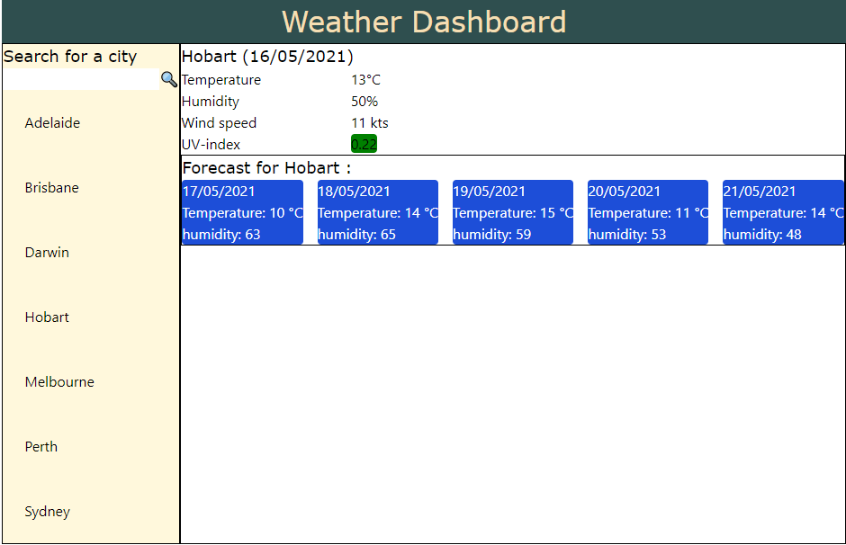

# Weather App

## About
 Project for the full stack flex web devleopment boot campl. 

 * [Example of the weather app](https://macoovacany.github.io/weatherApp/)

## picture

## Included features
 * City search
 * Remembers cities searched for
 * Updates the page with the city forecast details
 * Updates with briefing of 
 
## Mising features
 * cannot remove city from list of saved searches
 * icons missing from forecast results
 
## Bugs
 * only takes the first city search result. i.e. Melbourne return the city in Florida, US; not Victoria, Australia.

